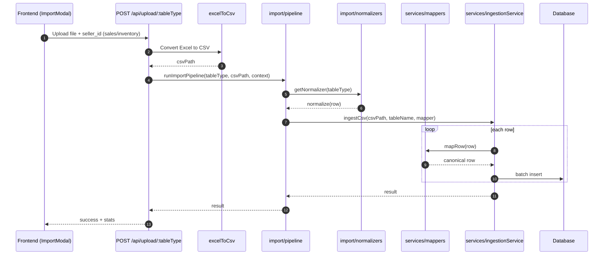

# Import Pipeline Flow

## Request-to-DB path

1. `routes/upload.js`
   - Validates upload, converts Excel to CSV.
   - Resolves `seller_id` to `platform_id` (sales/inventory).
   - Calls the import pipeline.

2. `services/import/pipeline.js`
   - Selects table-specific normalizer.
   - Streams CSV rows into the ingestion service.

3. `services/import/normalizers.js`
   - Dispatches to per-table normalization logic.
   - Sales/Inventory can enrich rows with `platform_id`.

4. `services/mappers.js`
   - Converts a single CSV row into a canonical DB row.
   - Handles date parsing, SKU/platform SKU, validation.

5. `services/ingestionService.js`
   - Streams rows and inserts in batches.

## Sequence diagram

## Why this structure

- Single streaming path for small + large files.
- Per-table normalization stays isolated and readable.
- Backend is the source of truth for canonical formats.
